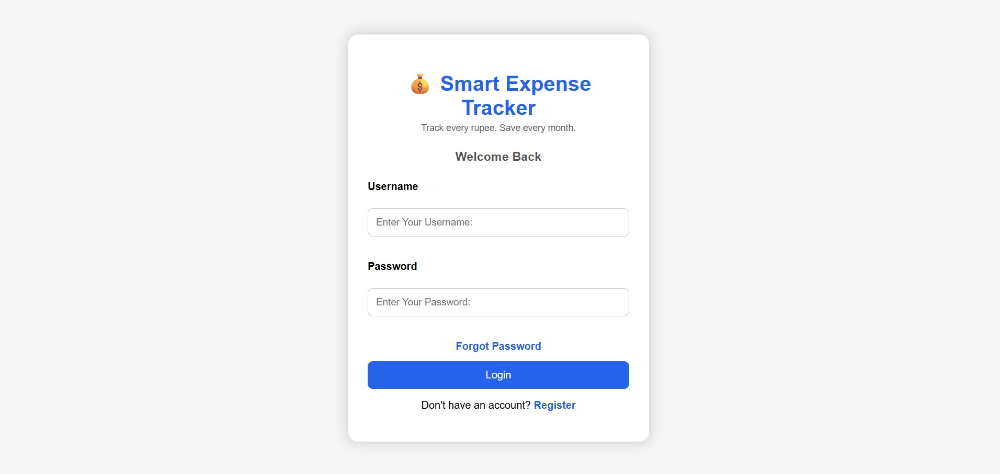
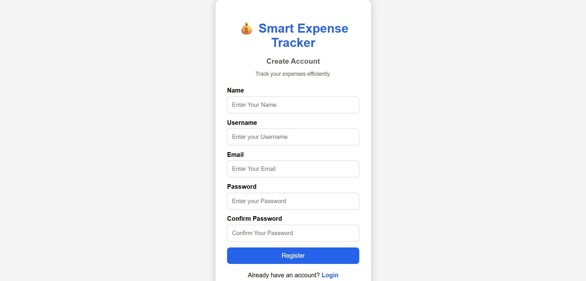
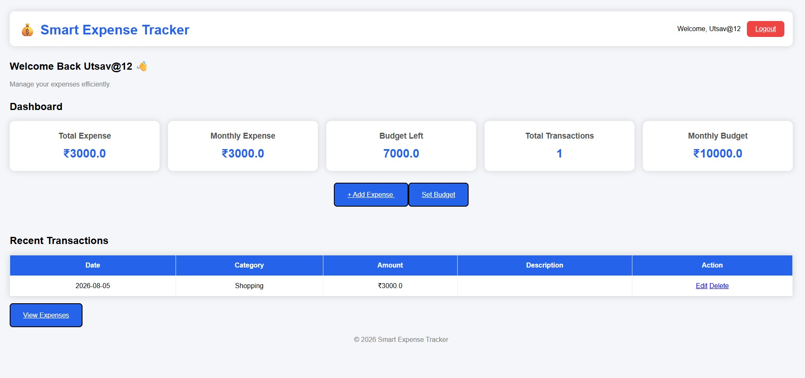
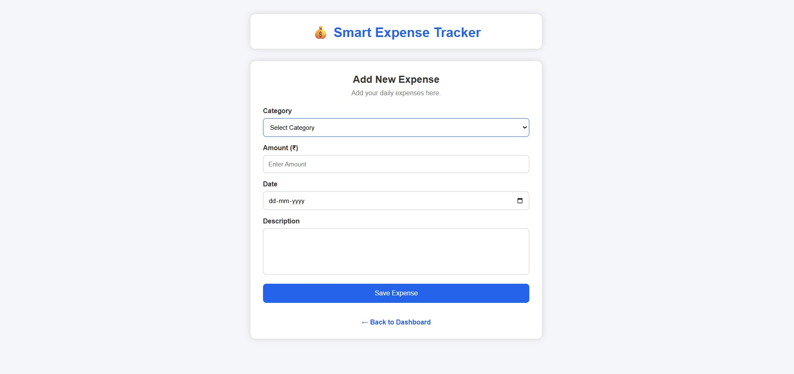
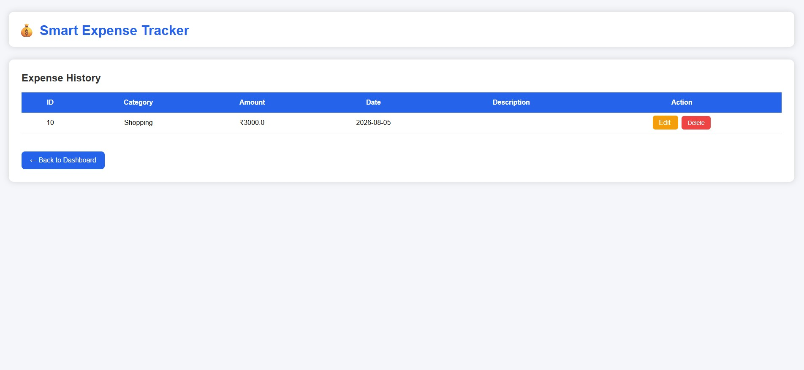
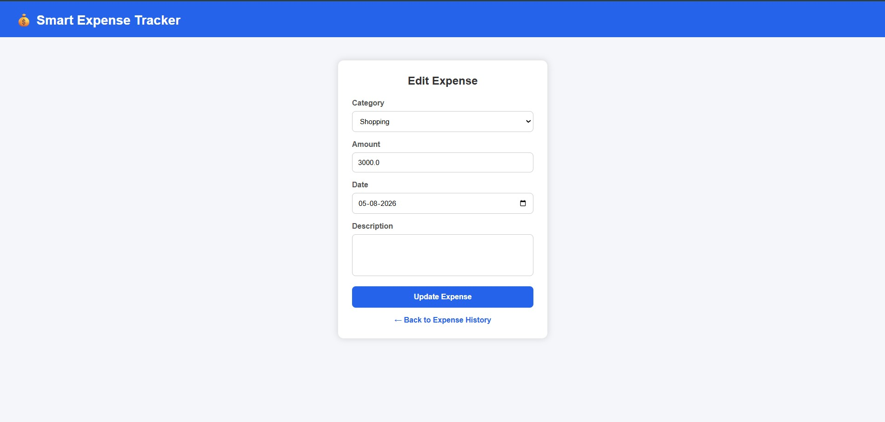
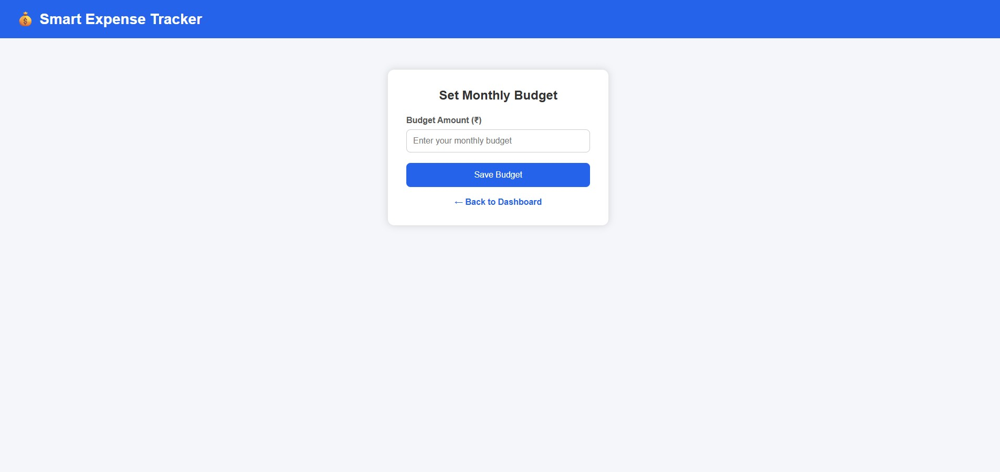

# 💰 Smart Expense Tracker

A web-based Expense Tracker built using **Python, Flask, SQLite, HTML, and CSS**. This application allows users to securely manage their daily expenses with authentication, budgeting, and expense tracking features.

---

## 🚀 Features

- 🔐 User Registration & Login
- 👤 Session-Based Authentication
- 💰 Set Monthly Budget
- ➕ Add New Expenses
- 📋 View Expense History
- ✏️ Edit Existing Expenses
- ❌ Delete Expenses
- 📊 Dashboard with:
  - Total Expense
  - Monthly Expense
  - Budget Left
  - Total Transactions
  - Recent Transactions
- 👥 User-wise Data Separation
- 🗄 SQLite Database Integration

---

## 🛠 Tech Stack

| Technology | Purpose |
|------------|---------|
| Python | Backend |
| Flask | Web Framework |
| SQLite | Database |
| HTML5 | Structure |
| CSS3 | Styling |
| Git | Version Control |
| GitHub | Repository Hosting |

---

## 📂 Project Structure

```text
smart-expense-tracker/
│
├── app.py
├── expense.db
├── templates/
│   ├── login.html
│   ├── register.html
│   ├── dashboard.html
│   ├── add_expense.html
│   ├── view_expense.html
│   ├── edit_expense.html
│   └── set_budget.html
│
├── static/
│
└── README.md
```

---

## 📸 Project Screenshots

> Add screenshots of the following pages:

- Login Page
- Register Page
- Dashboard
- Add Expense
- View Expenses
- Set Budget
- Edit Expense

---

## ⚙️ Installation

### 1. Clone the Repository

```bash
git clone https://github.com/hrishimathur19/smart-expense-tracker.git
```

### 2. Open the Project

```bash
cd smart-expense-tracker
```

### 3. Install Flask

```bash
pip install flask
```

### 4. Run the Application

```bash
python app.py
```

### 5. Open in Browser

```
http://127.0.0.1:5000
```

---

## 📈 Future Enhancements

- 🔍 Search Expenses
- 📅 Filter by Date
- 📂 Filter by Category
- 📊 Expense Charts & Analytics
- 📄 Export to PDF
- 📊 Export to Excel
- 🌙 Dark Mode
- 🤖 AI-Based Expense Insights
- ☁️ Cloud Database (MySQL/PostgreSQL)
- 🚀 Deployment on Render/Railway

---

## 📚 What I Learned

Through this project, I gained hands-on experience with:

- Flask Routing
- CRUD Operations
- SQLite Database
- User Authentication
- Session Management
- HTML & CSS
- Git & GitHub

---

## 📸 Project Screenshots

### Login Page



---

### Register Page



---

### Dashboard



---

### Add Expense



---

### View Expenses



---

### Edit Expense



---

### Set Budget



## 👨‍💻 Developer

**Rishi Mathur**

- GitHub: https://github.com/hrishimathur19

Repository:

https://github.com/hrishimathur19/smart-expense-tracker

---

⭐ If you found this project useful, consider giving it a star!